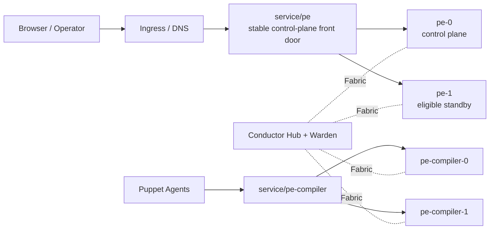

# Puppet Enterprise on Kubernetes

This repository runs Puppet Enterprise on Kubernetes without shared storage. It
keeps the PE installation model intact: the operator supplies a licensed PE
installer tarball, the chart installs PE onto per-replica persistent volumes,
and the runtime containers start the PE services from that installed state.

This is still development work. The current focus is to make the system
rebuildable, operable, and testable in Kubernetes with clear validation
tooling.

## Current Capabilities

- PE can be installed into Kubernetes workloads without redistributing the PE
  software in Git.
- A single Helm release can act as the HA domain for replicated `pe`
  control-plane replicas and a separate compiler pool.
- The design does not depend on shared RWX storage.
- `service/pe` can act as the stable control-plane front door with automatic
  failover and standby re-entry.
- Compilers can absorb catalog load separately from the PE control plane, which
  keeps the scaling story close to familiar PE deployments.
- CA operations, code deployment, orchestration, and agent traffic can all be
  exercised through live validation tooling.

## Current Topology



Today, multi-replica control planes use one active `service/pe` backend at a
time. That is a deliberate HA choice, not an accident. The compiler pool is
still where most catalog load should land.

## Current State

- Rebuild from repo workflows with a user-supplied installer tarball and
  repo-local values/secrets
- Per-replica PE control planes with stable identity and non-shared storage
- Separate compiler pool on non-shared storage
- Conductor-based trust distribution and participant onboarding
- Front-door status reporting and automatic failover between `pe` replicas
- CA enroll, sign, revoke, clean, and CRL pickup through failover
- Code Manager deploy convergence across `pe` replicas
- Shared classification convergence for the managed user-visible domain
- RBAC and local-auth convergence across `pe` replicas
- Orchestration task and plan execution across failover

## Current Limits

- Not a production-ready reference architecture
- Not a shared-storage design
- Not a compiler-to-compiler replication design
- Not a promise of perfectly pooled browser UX across replicas
- Not a generic chart bundle with tracked cluster-specific defaults

## Build, Deploy, Validate

### 1. Prepare Local Inputs

You need:

- `podman` or another compatible OCI builder
- `helm`
- `kubectl`
- write access to a container registry
- a PE installer tarball available locally

Repo-local operator inputs typically live in:

- `local/values-pe.yaml`
- `local/values-agent.yaml`
- `local/values-conductor.yaml`
- `local/keys/id-control_repo.ed25519`
- `local/license.txt` if you need to load a PE license from a Secret

Validate that local state before building:

```bash
make check-current-state PE_VERSION=2025.9.0
```

### 2. Build And Push Images

Build the PE runtime image:

```bash
CONTAINER_ENGINE=podman \
make build-k8s-runtime \
  PE_VERSION=2025.9.0 \
  PE_INSTALLER_TAR_PATH=/absolute/path/to/puppet-enterprise-2025.9.0-el-9-x86_64.tar.gz
```

Push it:

```bash
CONTAINER_ENGINE=podman \
make push-k8s-runtime \
  PE_VERSION=2025.9.0 \
  K8S_RUNTIME_IMAGE_NAME=registry.example.test/pe-k8s-runtime
```

Build and push the validation agent and Conductor images the same way:

```bash
CONTAINER_ENGINE=podman make build-k8s-agent K8S_AGENT_IMAGE_VERSION=<tag>
CONTAINER_ENGINE=podman make push-k8s-agent \
  K8S_AGENT_IMAGE_NAME=registry.example.test/pe-k8s-agent \
  K8S_AGENT_IMAGE_VERSION=<tag>

CONTAINER_ENGINE=podman make build-conductor CONDUCTOR_IMAGE_VERSION=<tag>
CONTAINER_ENGINE=podman make push-conductor \
  CONDUCTOR_IMAGE_NAME=registry.example.test/pe-k8s-conductor \
  CONDUCTOR_IMAGE_VERSION=<tag>
```

`PE_INSTALLER_TAR_PATH` is the actual runtime-image build input. The default
`installers/...` path is only a local Makefile convention.

### 3. Deploy

```bash
make deploy-conductor
make deploy-pe
make deploy-agent
```

These targets deploy from the repo-local values files. They do not provide a
tracked cluster profile for you.

### 4. Validate

Check the selected `service/pe` backend and standby eligibility:

```bash
make pe-frontdoor-status
```

Run the live HA validation:

```bash
make validate-stack
```

`validate-stack` currently runs:

- `scripts/pe-frontdoor-status.sh`
- `scripts/validate-pe-failover.sh`

The failover harness covers console reachability, code deploy, task/plan
execution, agent runs, fresh enrollment/signing, front-door failover,
revoke/clean, CRL pickup, revoked-cert rejection, and standby re-entry.

## Documentation Map

- [Solution Overview](docs/solution-overview.md)
  Public-facing architecture, current capabilities, and current limitations.
- [Validation Matrix](docs/validation-matrix.md)
  Behaviors and the commands that validate them.
- [Runtime Model](docs/runtime-model.md)
  Lower-level implementation details for contributors.
- [Conductor Architecture](docs/conductor-architecture.md)
  How Fabric, Warden, Relay, and Gateway map onto this repo.
- [Replication Roadmap](docs/replication-roadmap.md)
  Engineering roadmap for what is still ahead.
- [Legacy Service Mapping](docs/legacy-service-mapping.md)
  Background from the earlier container work.

## Helm Charts

- [charts/puppet-enterprise/README.md](charts/puppet-enterprise/README.md)
- [charts/puppet-agent/README.md](charts/puppet-agent/README.md)
- [charts/conductor-foundation/README.md](charts/conductor-foundation/README.md)

## Repository Layout

- `image/`: PE runtime image and entrypoint/runtime scripts
- `agent-image/`: validation agent image
- `conductor-image/`: participant, relay, gateway, and Warden images
- `charts/`: Helm charts
- `scripts/`: operator helpers and validation tooling
- `docs/`: architecture, roadmap, and implementation notes
