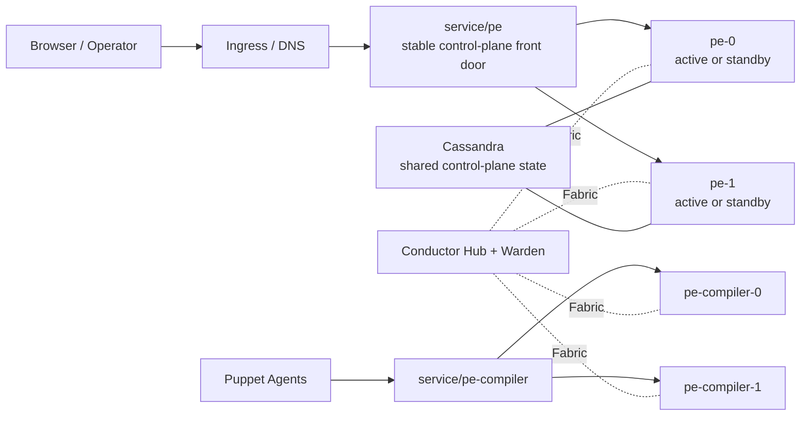

# Puppet Enterprise on Kubernetes

This repository is a proof of concept for running Puppet Enterprise on
Kubernetes without shared storage.

It keeps the licensed PE install flow intact:

- the operator supplies the PE installer tarball at image build time
- the chart installs PE onto per-replica persistent volumes
- the runtime pods start PE services from that installed state

The current goal is not a production-ready reference architecture. The current
goal is to prove that PE can be rebuilt, failed over, and validated in
Kubernetes with clear boundaries around what is shared, what is local, and
what still needs work.

## What This Repo Proves

- PE can be installed and rebuilt in Kubernetes from repo workflows without
  checking licensed software into Git.
- A single Helm release can host replicated `pe` control-plane replicas and a
  separate compiler pool.
- `service/pe` can provide stable-backend HA with automatic failover and
  standby re-entry.
- `service/pe-compiler` can carry catalog traffic separately from the
  control plane.
- Conductor provides onboarding, trust distribution, transport, and front-door
  eligibility signals.
- Cassandra-backed shared state now carries the replicated control-plane
  domains that used to rely on peer PostgreSQL replay.
- The live validation tooling exercises code deploy, orchestration, CA
  lifecycle, agent traffic, failover, and rebuildability.

## Current Topology



Multi-replica control planes currently use one selected `service/pe` backend
at a time. That is the current HA contract. The compiler pool remains the main
catalog scale surface.

## Current Shared-State Model

These control-plane domains now use Cassandra-backed shared state:

- filtered managed classifier graph
- login-session handoff
- managed RBAC graph and normal RBAC tokens
- persisted orchestration inventory connections
- persisted orchestration job and plan state

These domains still use other shapes:

- CA and trust: replicated files and trust bundles
- code deployment: deploy intent and convergence state
- live PCP broker presence: local runtime state on the active backend

## Current Limits

- This is still a proof of concept, not production guidance.
- `service/pe` is stable-backend HA, not arbitrary pooled browser traffic.
- Some PE behavior still depends on a selected control-plane backend.
- The tracked values files are examples, not complete environment profiles.

## Build, Deploy, Validate

### 1. Prepare Local Inputs

You need:

- `podman` or another compatible OCI builder
- `helm`
- `kubectl`
- write access to a container registry
- a PE installer tarball available locally

Repo-local operator inputs typically live in:

- `local/values-pe.yaml`
- `local/values-agent.yaml`
- `local/values-conductor.yaml`
- `local/keys/id-control_repo.ed25519`
- `local/license.txt` if you need to load a PE license from a Secret

Tracked starting points are in:

- `examples/values-pe.example.yaml`
- `examples/values-agent.example.yaml`
- `examples/values-conductor.example.yaml`

Typical setup:

```bash
mkdir -p local
cp examples/values-pe.example.yaml local/values-pe.yaml
cp examples/values-agent.example.yaml local/values-agent.yaml
cp examples/values-conductor.example.yaml local/values-conductor.yaml
```

Validate that local state before building:

```bash
make check-current-state PE_VERSION=2025.9.0
```

### 2. Build And Push Images

Build the PE runtime image:

```bash
CONTAINER_ENGINE=podman \
make build-k8s-runtime \
  PE_VERSION=2025.9.0 \
  PE_INSTALLER_TAR_PATH=/absolute/path/to/puppet-enterprise-2025.9.0-el-9-x86_64.tar.gz
```

Push it:

```bash
CONTAINER_ENGINE=podman \
make push-k8s-runtime \
  PE_VERSION=2025.9.0 \
  K8S_RUNTIME_IMAGE_NAME=registry.example.test/pe-k8s-runtime
```

Build and push the validation agent and Conductor images the same way:

```bash
CONTAINER_ENGINE=podman make build-k8s-agent K8S_AGENT_IMAGE_VERSION=<tag>
CONTAINER_ENGINE=podman make push-k8s-agent \
  K8S_AGENT_IMAGE_NAME=registry.example.test/pe-k8s-agent \
  K8S_AGENT_IMAGE_VERSION=<tag>

CONTAINER_ENGINE=podman make build-conductor CONDUCTOR_IMAGE_VERSION=<tag>
CONTAINER_ENGINE=podman make push-conductor \
  CONDUCTOR_IMAGE_NAME=registry.example.test/pe-k8s-conductor \
  CONDUCTOR_IMAGE_VERSION=<tag>
```

`PE_INSTALLER_TAR_PATH` is the real runtime-image build input. The default
`installers/...` path is only a local Makefile convention.

### 3. Deploy

```bash
make deploy-conductor
make deploy-pe
make deploy-agent
```

These targets deploy from repo-local values files under `local/`. The tracked
files under `examples/` are only the starting point.

### 4. Validate

Check the selected `service/pe` backend and standby eligibility:

```bash
make pe-frontdoor-status
```

Run the live validation wrapper:

```bash
make validate-stack
```

`validate-stack` currently runs:

- `scripts/pe-frontdoor-status.sh`
- `scripts/validate-pe-failover.sh`

The failover harness covers console reachability, code deploy, classifier and
RBAC projection, orchestration, agent runs, fresh enrollment and signing,
front-door failover, revoke and clean, CRL pickup, revoked-cert rejection,
Cassandra degradation, and standby re-entry.

## Documentation Map

- [Solution Overview](docs/solution-overview.md)
  High-level architecture, proof points, and limits.
- [Validation Matrix](docs/validation-matrix.md)
  Claims and the commands that validate them.
- [Shared State Backend](docs/shared-state-backend.md)
  Cassandra-backed shared-state model and what is still local.
- [Runtime Model](docs/runtime-model.md)
  Lower-level runtime and implementation detail.
- [Conductor Architecture](docs/conductor-architecture.md)
  How Fabric, Warden, Relay, and Gateway map onto this repo.
- [Replication Roadmap](docs/replication-roadmap.md)
  Remaining work and deferred follow-on items.
- [Legacy Service Mapping](docs/legacy-service-mapping.md)
  Historical background from earlier container work.

## Helm Charts

- [charts/puppet-enterprise/README.md](charts/puppet-enterprise/README.md)
- [charts/puppet-agent/README.md](charts/puppet-agent/README.md)
- [charts/conductor-foundation/README.md](charts/conductor-foundation/README.md)

## Repository Layout

- `image/`: PE runtime image and runtime scripts
- `agent-image/`: validation agent image
- `conductor-image/`: participant, relay, gateway, and Warden images
- `charts/`: Helm charts
- `scripts/`: operator helpers and validation tooling
- `docs/`: architecture and implementation notes
