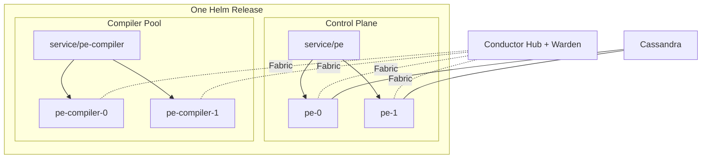
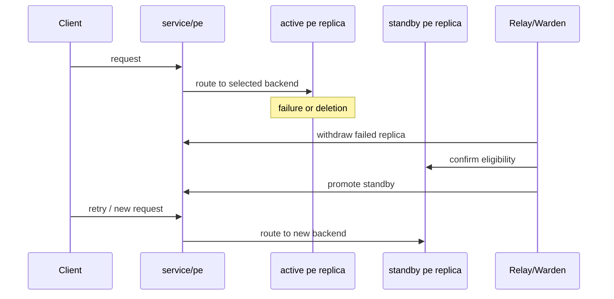

# Solution Overview

This is the short technical summary of the current implementation. It is meant
for readers who want the current architecture and proof points without going
straight into runtime detail.

## Scope

Traditional Puppet Enterprise deployments assume strong service locality and
scale outward through attached compilers. This project asks a narrower
question:

Can PE be rebuilt and operated in Kubernetes without shared storage while
keeping the familiar PE control-plane and compiler shape?

Current answer:

- yes for rebuildability
- yes for failover-oriented HA
- yes for Cassandra-backed shared state in the current replicated domains
- no for a fully pooled, replica-agnostic browser experience

## Design Constraints

- no shared RWX storage
- no redistribution of PE software in Git
- user-supplied installer tarball at image-build time
- one Helm release is the HA domain
- compilers remain the main scale surface for catalog traffic
- `service/pe` remains the control-plane front door

## Current Runtime Model

- each `pe` replica installs PE onto its own PVC set
- each compiler installs its own runtime onto its own PVC set
- `service/pe` points at one eligible control-plane replica at a time
- `service/pe-compiler` exposes the compiler pool for agent-facing traffic
- Conductor provides transport, trust, and front-door eligibility
- Cassandra provides shared state for the replicated control-plane domains

## What Has Been Proven

### Rebuildability

- The stack can be destroyed and recreated from repo workflows.
- Rebuild depends on repo-managed charts and scripts plus operator-supplied
  licensed artifacts and secrets.
- The rebuilt stack can pass the live validation harness.

### Control-Plane HA

- `service/pe` can fail over between `pe` replicas.
- Standby replicas can re-enter eligibility automatically.
- Front-door status is inspectable through repo tooling.

### CA Lifecycle

- Fresh agent enrollment and signing work through the current `service/pe`
  backend.
- Revocation and clean propagate through the replicated trust model.
- Compilers pick up CRL changes and reject revoked certificates.

### Compiler-Oriented Scale Story

- Catalog traffic is served through `service/pe-compiler`.
- Compiler PCP brokers still fit the familiar PE model.
- The control plane is not being used as the main catalog scale surface.

### Shared Control-Plane State

The current shared-state model covers:

- filtered managed classifier graph
- login-session handoff
- managed RBAC graph and normal RBAC tokens
- persisted orchestration inventory connections
- persisted orchestration job and plan state

These domains now use Cassandra-backed Conductor state instead of peer
PostgreSQL replay.

## Current Traffic And Failover Model

The control plane is currently stable-backend HA rather than freely pooled
multi-replica service.

That means:

- one `pe` replica is the selected backend for `service/pe`
- another healthy replica can stand by and take over
- browser and API traffic see one stable backend at a time
- compilers and agents still use stable service names and do not need to know
  which pod is selected

## Current Limits

- This is still a proof of concept, not production guidance.
- `service/pe` is stable-backend HA, not arbitrary pooled browser traffic.
- Some PE surfaces still assume strong local identity and locality.
- The tracked values files are examples, not ready-made environment profiles.

## Where To Read Next

- [Validation Matrix](validation-matrix.md)
- [Shared State Backend](shared-state-backend.md)
- [Runtime Model](runtime-model.md)
- [Conductor Architecture](conductor-architecture.md)
- [Replication Roadmap](replication-roadmap.md)
