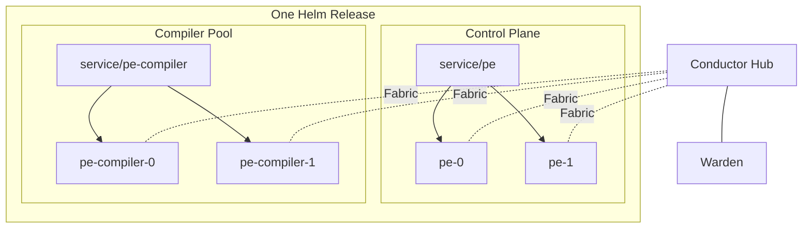
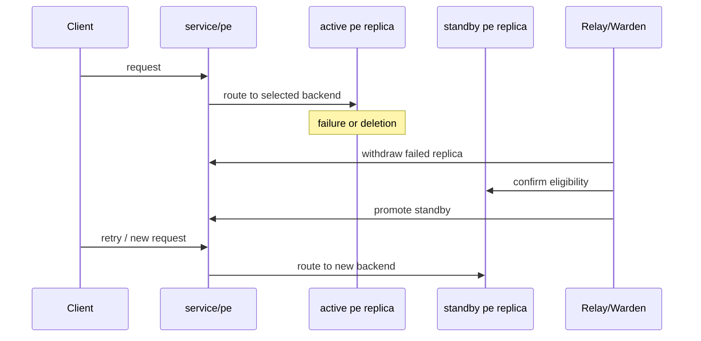

# Solution Overview

This document is the high-level technical summary of the current
implementation. It is intended to be readable by someone evaluating the
project without having to start in the lower-level runtime docs.

## Scope

Traditional Puppet Enterprise deployments assume a relatively static set of
hosts, strong service locality, and scaling through attached compilers. The
current work is focused on a narrower question:

Can PE be rebuilt and run in Kubernetes without shared storage while keeping
compilers as the main scaling surface?

Current status:

- yes for rebuildability
- yes for failover-oriented HA
- partially for broader control-plane state convergence
- not yet for a perfectly pooled, fully linearizable multi-replica UI

## Design Constraints

- No shared RWX storage
- No redistribution of PE software in Git
- User-supplied installer tarball at image-build time
- One Helm release is the replication domain
- Compilers remain the primary scale surface for catalog traffic
- `service/pe` remains the main control-plane front door

## Current Runtime Model

- Each `pe` replica installs PE onto its own PVC set.
- Each compiler installs its own compiler-local runtime onto its own PVC set.
- `service/pe` points at one eligible control-plane replica at a time.
- `service/pe-compiler` exposes the compiler pool for agent-facing traffic.
- Conductor provides the queue and trust layer for replicated control-plane
  state.

## What Has Been Proven

### Rebuildability

- The stack can be destroyed and recreated from repo workflows.
- The rebuild depends on repo-managed charts, scripts, and local values, plus
  operator-supplied licensed artifacts and secrets.
- The resulting deployment can pass the live HA harness after rebuild.

### Control-Plane HA

- `service/pe` can fail over between `pe` replicas.
- Standby replicas can re-enter eligibility automatically.
- Front-door status is inspectable through repo tooling.

### CA Lifecycle

- Fresh agent enrollment and signing work through the current `service/pe`
  backend.
- Revocation and clean propagate through the replicated trust model.
- Compilers pick up CRL changes and reject revoked certificates.

### Compiler-Oriented Scale Story

- Catalog traffic is served through `service/pe-compiler`.
- Compiler PCP brokers remain aligned with a traditional PE mental model.
- The control plane is not being used as the primary scaling surface.

### Replicated Control-Plane State

The current replicated state includes:

- filtered user-visible classification
- the filtered managed classifier graph can move through a Cassandra-backed
  Conductor shared-state path
- RBAC and local-auth managed state
- login-session handoff can move through a Cassandra-backed Conductor store
  instead of direct peer database writes
- the remaining managed RBAC graph and normal RBAC tokens can move through the
  same Cassandra-backed shared-state path
- persisted orchestration inventory can move through the same Cassandra-backed
  shared-state path
- persisted orchestration job and plan state can move through the same
  Cassandra-backed shared-state path
- code deployment intent and convergence state
- managed orchestration data needed for task and plan failover

The shared-state path for auth and persisted orchestration data is now
Cassandra-backed Conductor state. That preserves the current `service/pe` /
`service/pe-compiler` deployment shape without making one `pe` replica
special.

## Current Traffic And Failover Model

The control plane is currently failover-oriented rather than freely pooled.

That means:

- one `pe` replica is the selected backend for `service/pe`
- another healthy replica can stand by and take over
- browser and API traffic see one stable backend at a time
- compilers and agents still use stable service names and do not need to know
  the selected pod

## Current Limits

- This is still a development project, not production guidance.
- `service/pe` is stable-backend HA, not arbitrary pooled active-active UI.
- Some PE surfaces still assume strong local identity and locality.
- The chart values are intentionally generic; operators must supply their own
  cluster profile.

## Where To Read Next

- [Validation Matrix](validation-matrix.md)
- [Shared State Backend](shared-state-backend.md)
- [Runtime Model](runtime-model.md)
- [Conductor Architecture](conductor-architecture.md)
- [Replication Roadmap](replication-roadmap.md)
